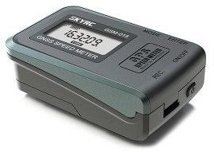

# skyrc-gsm015
The SkyRC GSM-015 GNSS Speed Meter happens to work as a GNSS logger as well as it's speed functions.

The OEM software supplied is not ideal for automated download of track logs. This command line Python tool/library allows automatic download of the track logs and export in IGC format.

## Limitations
Setting of configuration options is not currently supported. Appropriate configuration should be set using the OEM tool.

## Links
* [OEM marketing material, manuals and software](https://www.skyrc.com/gpsgsm015)

